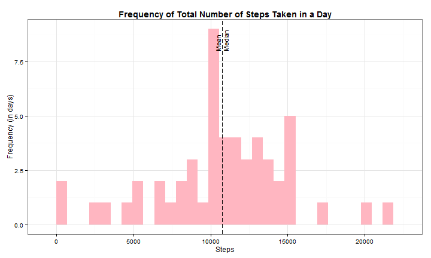
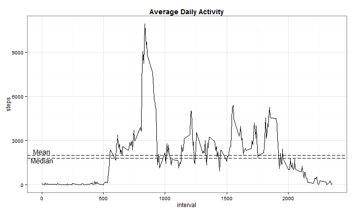
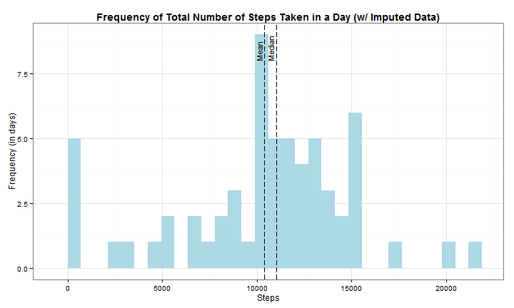
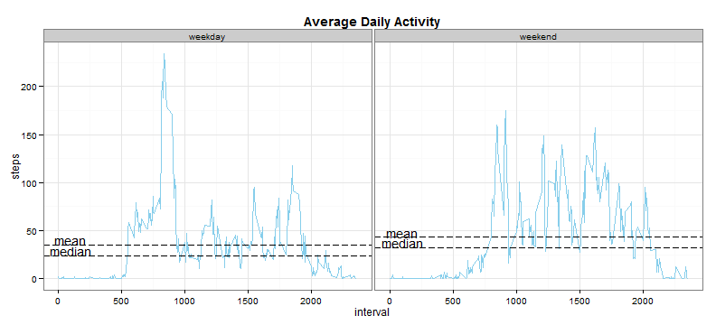

Reproducible Research : Assessment 1
========================================================
#Introduction
It is now possible to collect a large amount of data about personal movement using activity monitoring devices such as a Fitbit, Nike Fuelband, or Jawbone Up. These type of devices are part of the "quantified self" movement -- a group of enthusiasts who take measurements about themselves regularly to improve their health, to find patterns in their behavior, or because they are tech geeks. But these data remain under-utilized both because the raw data are hard to obtain and there is a lack of statistical methods and software for processing and interpreting the data.

This assignment makes use of data from a personal activity monitoring device. This device collects data at 5 minute intervals through out the day. The data consists of two months of data from an anonymous individual collected during the months of October and November, 2012 and include the number of steps taken in 5 minute intervals each day...


# Data
Dataset: Activity monitoring data [52K]
The variables included in this dataset are:

1. steps: Number of steps taking in a 5-minute interval (missing values are coded as NA)
2. date: The date on which the measurement was taken in YYYY-MM-DD format
3. interval: Identifier for the 5-minute interval in which measurement was taken

The dataset is stored in a comma-separated-value (CSV) file and there are a total of 17,568 observations in this dataset.


# Assignment

## Loading and preprocessing the data

```r
library(data.table)
library(ggplot2)
library(lattice)
library(xtable)
data<-read.table("activity.csv", header=TRUE, sep=",", colClasses=c("integer", "Date", "integer"))
```


## What is mean total number of steps taken per day?

```r
a<-aggregate(steps~date, data=data, FUN=sum)
alpha<-mean(a$steps)
gamma<-median(a$steps)
stats<-data.frame(stat=c(alpha, gamma), label=c("Mean", "Median"))
temp<-stats
temp$stat[2]<-temp$stat[2]+500
```
**MEAN**

```
## [1] 10766
```
**MEDIAN**

```
## [1] 10765
```
**PLOT** 

*Histogram of the total number of steps taken each day*

```r
g<-ggplot(a, aes(steps)) + geom_histogram(fill="lightpink")+geom_vline(data=stats, mapping=aes(xintercept=stat), linetype="longdash")+geom_text(data=temp, mapping=aes(x=stat, y=8, label=label), size=4, angle=90, vjust=-0.4, hjust=0)
g+theme_bw()+ggtitle("Frequency of Total Number of Steps Taken in a Day")+theme(plot.title = element_text(lineheight=10, face="bold"))+ylab("Frequency (in days)")+xlab("Steps")
```

```
## stat_bin: binwidth defaulted to range/30. Use 'binwidth = x' to adjust this.
```

 


## What is the average daily activity pattern?

```r
b<-data.table(aggregate(steps~interval, data=data, FUN=sum))
stats<-data.frame(stat=c(mean(b$steps), median(b$steps)), label=c("Mean", "Median"))
temp<-stats
temp$stat[]<-c(temp$stat[1]+250,temp$stat[1]-350)
```
Which 5-minute interval, on average across all the days in the dataset, contains the maximum number of steps?

```r
b[steps==max(steps)]
```

```
##    interval steps
## 1:      835 10927
```
**PLOT** 

*Time series plot of the 5-minute interval and the average number of steps taken, averaged across all days*

```r
g<-ggplot(b, aes(x=interval, y=steps))+geom_line()+geom_hline(data=stats, aes(yintercept=stat), linetype="longdash")+geom_text(data=temp, aes(x=0, y=stat, label=label))
g+theme_bw()+ggtitle("Average Daily Activity")+theme(plot.title = element_text(lineheight=10, face="bold"))
```

 


## Imputing missing values
The strategy used for imputing missing values in the dataset is to fill in the NA values with their respective day's mean. If the entire day's data is not available then 0 is used. 


Total number of missing values in the dataset

```r
sum(!complete.cases(data))
```

```
## [1] 2304
```

```r
mean_d<-data.table(aggregate(steps~date, data, mean))
d<-data.table(date=unique(data$date))
mean_date<-data.table(merge(mean_d, d, by="date", all=TRUE))
mean_date$steps[is.na(mean_date$steps)]<-0
imp<-merge(data, mean_date, by="date", all=TRUE)
imp$steps.x[is.na(imp$steps.x)]<-imp$steps.y
```

```
## Warning: number of items to replace is not a multiple of replacement
## length
```

```r
imp_data<-data.table(date=imp$date, steps=imp$steps.x, interval=imp$interval)
a_i<-aggregate(steps~date, data=imp_data, FUN=sum)
stats<-data.frame(stat=c(mean(a_i$steps), median(a_i$steps)), label=c("Mean", "Median"))
```
**MEAN**

```
## [1] 10392
```
**MEDIAN**

```
## [1] 11015
```
**PLOT** 

*Histogram of the total number of steps taken each day for* **Imputed Data**

```r
g<-ggplot(a_i, aes(steps)) + geom_histogram(fill="lightblue")+geom_vline(data=stats, mapping=aes(xintercept=stat), linetype="longdash")+geom_text(data=stats, mapping=aes(x=stat, y=8, label=label), size=4, angle=90, vjust=-0.4, hjust=0)
g+theme_bw()+ggtitle("Frequency of Total Number of Steps Taken in a Day (w/ Imputed Data)")+theme(plot.title = element_text(lineheight=10, face="bold"))+ylab("Frequency (in days)")+xlab("Steps")
```

```
## stat_bin: binwidth defaulted to range/30. Use 'binwidth = x' to adjust this.
```

 

**Do these values differ from the estimates from the first part of the assignment?**
The imputed data has deviated the mean and median from the data set. Also the 0 steps have increased which is a major reason for the lower median.

**What is the impact of imputing missing data on the estimates of the total daily number of steps?**
The mean differs by about 373 steps and the Median differs by -250 steps.


## Are there differences in activity patterns between weekdays and weekends?
As seen in the graph below, the average steps on weekdays start earlier than weekends. This may be due to waking up late on weekends. Also through out the day the weekends have more constant activity, where as weekdays have more activity in the early hours then the rest of the day. 


```r
temp<-data
data$day<-weekdays(data$date)
wd<-c("Monday", "Tuesday", "Wednesday", "Thursday", "Friday")
we<-c("Saturday", "Sunday")
wday<-data.table(day=c("Monday", "Tuesday", "Wednesday", "Thursday", "Friday", "Saturday", "Sunday"), days=c("weekday", "weekday", "weekday", "weekday", "weekday", "weekend", "weekend"))
merged<-data.table(merge(data, wday))
merged$days<-factor(merged$days)
merged$interval<-factor(merged$interval)
c<-aggregate(steps~interval+days, data=merged, FUN=mean)
c$interval<-as.integer(levels(droplevels(c$interval)))
wday<-c[(c$days=="weekday"),]
wend<-c[(c$days=="weekend"),]
dat.hline <- data.frame(days = c("weekday", "weekend", "weekday", "weekend"), xp = c(mean(wday$steps), mean(wend$steps), median(wday$steps), median(wend$steps)))

dat.text <- data.frame(Type = c("weekday", "weekend", "weekday", "weekend"), xp = c(mean(wday$steps), median(wday$steps), mean(wend$steps), median(wend$steps)), label = c("mean","median", "mean", "median"))
```
**PLOT** 

*Panel plot containing a time series plot of the 5-minute interval and the average number of steps taken, averaged across all weekday days or weekend days*

```r
g<-ggplot(data=c, aes(x=interval, y=steps))+geom_line(colour="skyblue")+facet_grid(~days)+geom_hline(aes(yintercept = xp), data = dat.hline, linetype="longdash")+geom_text(aes(x=100, y=xp+5, label = dat.text$label), data = dat.hline)
g+theme_bw()+ggtitle("Average Daily Activity")+theme(plot.title = element_text(lineheight=10, face="bold"))
```

 
